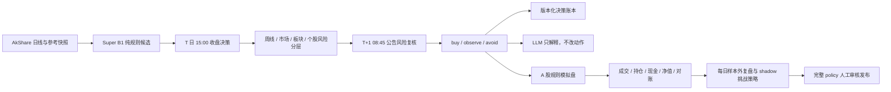

# A 股量化研究与分层决策系统

基于 Python、AkShare、Flask、SQLite 和 React 的个人 A 股研究工具。它负责行情更新、规则候选生成、版本化分层决策、盘前事件复核、模拟盘、样本外复盘与可视化。

> 本项目只用于研究和自动化分析，不构成投资建议，也不承诺收益。模型、回测和页面提示都不能替代独立判断。

## 当前状态

- GitHub Actions 在 `main` push 后自动部署，也支持手工触发；两种方式都部署 `origin/main` 到 `/opt/a-share-quant`。以线上健康检查和 Git SHA 判断实际发布状态。
- 每日任务会处理前一交易日的模拟委托、更新净值与对账、回填标签、登记 shadow 挑战策略，再生成当日收盘决策和 AI 留痕。
- 每日任务无权自动替换生产策略；完整策略必须作为一个原子 policy 通过样本外证据、统计功效和人工批准后才能发布。
- `config/config.yaml` 仍存在历史跟踪风险。不要打印或提交其中的真实凭证；安全处置见 [已知限制](docs/known-limitations.md)。
- 历史行情抓取当前在真实来源连续失败后可能生成随机 OHLCV 并写入正式 CSV；该路径修复、受影响数据重建并完成来源核验前，任何相关研究或模型结果都不可发布。

## 决策链路



关键边界：

- 本地行情不新鲜时，收盘决策拒绝生成。
- 规则 baseline 使用 Super B1；周线四均线默认只做 shadow 记录。
- 未经 point-in-time 快照与 purged walk-forward 验证的市场/板块/风险/质量完整 policy 不能 active；不允许逐层拼接生产策略。
- `strict_unvalidated_gate=true` 时，没有已验证的 market 模型只输出 `observe`。
- 版本化决策在没有已验证质量模型时不伪造精确 top-1；超过 3 只会降级观察。
- 沿用旧响应形状的 `/api/quant-pick` 会把云阶命中按当前板块综合热度排列，但这只是展示顺序：它不等于 `buy` 动作，也没有完成完整 policy 的 point-in-time / purged walk-forward 发布门禁。当前 `today_buy` 语义与旧客户端“今日推荐”展示冲突，修复前不可发布。
- 盘前复核只使用截止时点已公开的公告；来源缺失时降级观察。
- LLM 只做结构化公告标签、候选解释和可审计留痕，没有自由排序权；无合格候选或未配置时也会记录 `not_called`/`abstained` 原因。
- 模拟盘遵守 100 股整数手、T+1、涨跌停不可成交、佣金/印花税/过户费与滑点；缺行情时延期，不制造成交。

完整方法与证据边界见 [模型治理](docs/model-governance.md)。

## 产品界面

React 前端当前路由：

- `/sectors`：默认入口，单页板块工作台；在同一页完成排名、趋势、指标、候选、证据和系统状态查看；
- `/stocks`：策略组合工作台，并可切换查看独立的 B1 分层决策；
- `/review`：历史结果、战绩、策略因子、板块和模型复盘；
- `/stock/:code`：个股资料、日/周 K 与历史信号。

旧 `/today`、`/performance`、`/history` 会重定向到当前页面。视觉规范见 [DESIGN.md](DESIGN.md)。

## 本地运行（当前受阻）

建议使用 Python 3.11+ 与 Node.js 22：

```bash
python3 -m venv .venv
source .venv/bin/activate
pip install -r requirements.txt

cp config/config.yaml.template config/config.yaml
```

当前没有“不触发行情写入”的受支持后端启动命令：`python3 main.py web` 会同时启动 scheduler 和六年股票池回补，而回补在真实行情双源失败后可能写入随机数据。因此，修复 fallback 并提供禁用 bootstrap 的开关前，不要对可信或发布数据目录执行 `web`、`init`、bootstrap 或全量回补。

已有独立、受控的测试 API 时，可以只运行前端：

```bash
cd frontend
npm ci
npm run dev
```

开发界面位于 `http://127.0.0.1:3000`，Vite 默认把 `/api` 代理到受控后端 `127.0.0.1:18321`；也可用 `VITE_API_BASE` 指定测试 API。项目没有应用层登录或 CSRF 防护，本地开发与生产都必须用防火墙、反向代理或私网限制访问，不能把端口直接暴露给不可信网络。

## CLI

`main.py` 当前只接受以下命令：

| 命令 | 作用 |
| --- | --- |
| `python3 main.py init` | 初始化历史行情；当前只能用于隔离实验，不能生成发布数据 |
| `python3 main.py update` | 更新本地行情 |
| `python3 main.py run` | 更新、运行既有选股流程并记录结果 |
| `python3 main.py track` | 回填并查看历史战绩 |
| `python3 main.py backtest` | 运行历史回测 |
| `python3 main.py web` | 启动 Flask、调度器、后台六年股票池回补与前端静态服务；当前不能用于可信数据目录 |

旧文档中的 `select` 与 `schedule` 已不是合法 CLI 命令。

## 验证

`pytest` 不在运行时依赖中；新环境先显式安装测试工具：

```bash
python3 -m pip install pytest
python3 -m pytest -q

cd frontend
npm run lint
npm run build

cd ..
git diff --check
```

验证基线以本次 `pytest`、前端 lint 和生产构建的实际输出为准。ECharts chunk 仍可能超过 Vite 500 kB 警告阈值。

测试不得调用真实通知、LLM 或生产部署。涉及行情、公告和回测的结论还必须核对 as-of 时点、历史证券宇宙、交易成本与成交可执行性。

## 配置与数据

- `config/config.yaml.template`：运行配置模板；真实 `config.yaml` 不应被 Git 跟踪。
- `config/strategy_params.yaml`：传统策略与 B1 参数。
- `data/`：行情、参考快照、回测产物与主 `views.db`；属于运行数据，不进入 Git。
- `views/views.db`：不是运行数据库；正确位置是 `data/views.db`。
- LLM 可使用 Ark 或 Anthropic；未配置凭证时解释功能停用，不影响规则决策。

## 部署

Docker Compose 将容器 5000 映射到宿主机 18321，并用 volume 持久化 `data/`。当前仓库没有 `.dockerignore`，而 Dockerfile 使用 `COPY . .`；在改成严格构建白名单并完成凭证处置前，不得从含本地配置、数据、虚拟环境或 Git 元数据的工作区构建或分发镜像。GitHub workflow 在 `main` 更新后拉取代码、构建容器、检查 `/api/stats`，再更新行情并生成收盘决策；常驻服务的 APScheduler 负责每日模拟盘、复盘、AI 留痕与盘前委托。

生产操作、回滚与数据保全见 [运维手册](docs/operator-runbook.md)。`deploy.sh` 包含 SSH、`rsync --delete` 与远端重建动作，只能在明确授权并完成备份核对后手动执行。

## 文档

- [Agent 入口](CLAUDE.md)
- [文档索引](docs/INDEX.md)
- [系统架构](docs/architecture.md)
- [模型治理](docs/model-governance.md)
- [运维手册](docs/operator-runbook.md)
- [已知限制](docs/known-limitations.md)
- [设计规范](DESIGN.md)
- [B1 图形匹配参考](B1_PATTERN_MATCH.md)
