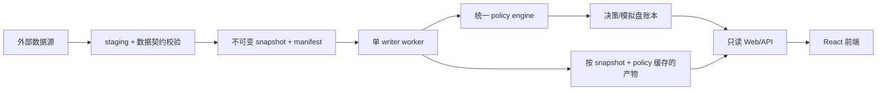

# A 股量化研究与分层决策系统

这是一个基于 Python、AkShare、Flask、SQLite 和 React 的 A 股研究工具。它负责构建不可变行情快照、生成 Super B1 候选、执行分层决策、记录模拟盘和样本外证据。

> 本项目只用于研究和自动化分析，不构成投资建议，不承诺收益，不允许接入真实交易。

## 当前状态

审查报告中的本地代码整改已纳入专用修复分支，但不能因此推断线上已更新。线上状态必须同时核对完整 Git SHA、镜像 digest、`/api/version` 和当前 snapshot ID。

重新开放无人值守模拟盘前，仍有两类必须在仓库外完成的操作：

1. 从可信数据源全量重建行情与参考快照，不复用真实性存疑的旧数据。
2. 在目标生产环境完成备份恢复、上游故障、磁盘满、SQLite 锁和告警回滚演练。

详细操作见 [运维手册](docs/operator-runbook.md)。

## 可信边界

- 外部数据失败时直接失败，不生成随机或模拟行情。
- 全市场先写 staging，通过日期、OHLC、交易日历、覆盖率、来源和哈希校验后，再原子切换当前快照。
- freshness 必须等于预期已完成交易日，覆盖率不低于 98%，锚定股和独立数据源必须达到规定数量。
- 生产、回放、walk-forward 和模拟盘共用同一决策/成交规则，并绑定 snapshot、policy、代码和数据版本。
- Web 不抓行情、不跑策略、不调用 LLM、不运行调度器；GET 只读 worker 已发布的结果。
- 任务失败和租约耗尽会追加不可修改的告警事件，受保护的只读接口可供生产监控消费。
- 持久任务队列有硬容量上限；管理员只能取消尚未开始的任务，运行中的任务不会被虚假标记为已取消。
- 写接口使用 Bearer Token 的 viewer/publisher/admin 角色、短时 HMAC 验签和 nonce 防重放，并持久限流、请求 ID、变更原因和审计记录。
- 未经独立校准、样本外证据、前向观察和双人审批的完整 policy 不能激活；shadow 不能进入生产。
- LLM 只解释已确定的动作，不能选股、改排名或改写 buy/observe/avoid。

## 进程和数据流



SQLite 只适用于当前单机、单行情/决策 writer、低并发边界。operations DB 还会接收单个 Web 进程和 worker 的短事务，由 WAL、`BEGIN IMMEDIATE` 与 busy timeout 串行化；它不是多机队列。数据库迁移是独立一次性命令，Web、worker 和普通业务写入只校验已有 schema，不会隐式建表。

## 快速开始

建议使用 Python 3.11.9 和 Node.js 22.17.1。

```bash
python3.11 -m venv .venv
source .venv/bin/activate
python -m pip install --require-hashes -r requirements.lock

# 首次运行和每次升级后都先执行
python main.py migrate

# 终端 1：只读 Web/API
python main.py web --host 127.0.0.1 --port 5000

# 终端 2：唯一 worker 和调度 leader
python main.py worker
```

前端开发：

```bash
cd frontend
npm ci
npm run dev
```

管理凭证必须至少 32 个字符、三个角色互不相同。本地可以使用 `QUANT_VIEWER_TOKEN`、`QUANT_PUBLISHER_TOKEN` 和 `QUANT_ADMIN_TOKEN`；生产必须使用只读 secret file 及对应的 `*_FILE` 变量，不要写进仓库或命令行历史。

## 生产 CLI

| 命令 | 作用 |
| --- | --- |
| `python main.py migrate` | 显式迁移两个 SQLite 账本并做只读复验 |
| `python main.py web` | 启动只读 Web/API |
| `python main.py worker` | 启动任务 worker 和唯一调度 leader |
| `python main.py enqueue-ingestion` | 提交每日行情快照任务 |
| `python main.py enqueue-close` | 提交完整收盘 DAG |
| `python main.py enqueue-rebuild --years 6` | 提交可信数据全量重建 |
| `python main.py legacy-location` | 只显示已隔离的旧研究 CLI 位置 |

所有长任务都写入持久任务队列，不在 Web 请求里执行。

## 验证

```bash
ruff check main.py worker.py web_server.py utils views strategy tools tests
ruff format --check main.py worker.py web_server.py utils views strategy tools tests
mypy --follow-imports=skip utils/api_security.py utils/data_contracts.py \
  utils/artifact_integrity.py utils/decision_ledger.py utils/market_snapshot.py \
  utils/operations_store.py utils/runtime_schema.py utils/task_submission.py \
  utils/probability_model.py tools/hierarchical_walk_forward.py \
  tools/migration_dry_run.py
python -m pytest -q \
  --cov=utils.api_security --cov=utils.artifact_integrity \
  --cov=utils.csv_manager --cov=utils.data_contracts \
  --cov=utils.data_freshness --cov=utils.decision_ledger \
  --cov=utils.execution_model --cov=utils.market_snapshot \
  --cov=utils.operations_store --cov=utils.paper_trading \
  --cov=utils.probability_model --cov=utils.reference_snapshots \
  --cov=utils.runtime_schema --cov-report=term-missing --cov-fail-under=75

cd frontend
npm ci
npm run lint
npm run test
npm run build
npm audit --audit-level=high
```

CI 还执行 pip-audit、Bandit、Hadolint 和 Trivy。详细发布门禁见 [运维手册](docs/operator-runbook.md)。

## 部署

生产 Compose 只将 Web 绑定到 `127.0.0.1:18321`，Web 对市场数据 volume 只读，运行账本使用独立 state volume。默认启动一次性 `migrate`、`web` 和 `worker`，另有只在发布时启用、对 data/state 都只读的 `canary` profile。发布 workflow 只接受人工输入的 40 位完整 SHA，从该 SHA 构建一次，按 digest 部署，并生成 SBOM/来源证明、签名和漏洞扫描。人工触发后，流程按“暂停旧 writer → 一致备份 → 临时副本迁移演练 → 显式迁移 → 只读检查 → canary → 切换 → SHA/readiness 校验”执行；切换前失败会重启旧服务，切换后失败会回退应用镜像。

## 文档

- [文档索引](docs/INDEX.md)
- [系统架构](docs/architecture.md)
- [模型治理](docs/model-governance.md)
- [运维手册](docs/operator-runbook.md)
- [已知限制](docs/known-limitations.md)
- [设计规范](DESIGN.md)
