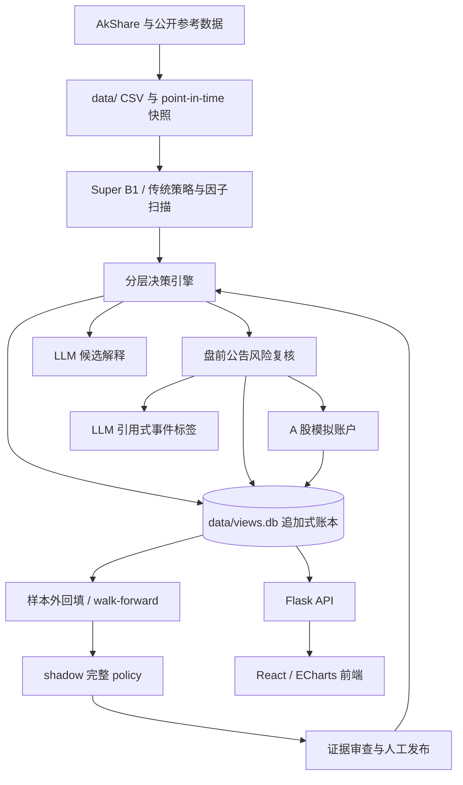

# 系统架构

更新时间：2026-07-17。发布状态必须以线上健康检查与部署 SHA 为准。

## 数据流

## 后端模块

- `main.py`：CLI；初始化、更新、运行、战绩、回测和 Web。
- `web_server.py`：Flask app、传统视图 API、股票/K 线 API、调度器和静态前端。
- `strategy/`：BowlRebound、Super B1、传统 B1 图形匹配与因子库。
- `utils/super_b1_scan.py`：当前纯规则 baseline。
- `utils/hierarchical_decision.py`：收盘与盘前两阶段决策。
- `utils/decision_ledger.py`：append-only 决策、AI、事件证据、演进尝试、完整 policy 与发布事件。
- `utils/paper_trading.py`：模拟账户、委托、成交尝试、持仓批次、现金、净值与对账。
- `utils/ai_decision.py`：根据量化决策记录 `not_called`、`abstained`、`explained`、`shadow_ranked` 或失败状态。
- `utils/decision_versions.py`：策略、特征、模型和数据指纹。
- `utils/reference_snapshots.py`：历史时点参考数据快照。
- `tools/hierarchical_walk_forward.py`：purged walk-forward 训练与验证。
- `utils/event_risk.py`：公告获取、硬规则与可选 LLM 标签。
- `utils/daily_pick.py`：旧荐票档案兼容与当前解释器；生产 LLM 无选票权。

## API

主要只读能力：

- `/api/stats`、`/api/stocks`、`/api/stock/<code>`、K 线与行业；
- `/api/super-b1`、`/api/factors`、`/api/quant-pick`；
- `/api/decision/latest`、`/api/decision/<run_id>`、`/api/decision/system-status`；
- `/api/performance/*`、`/api/decision/evolution`。

会修改运行状态或数据的端点包括：

- `POST /api/data/update`；
- `POST /api/data/bootstrap`；
- `POST /api/decision/close`、`POST /api/decision/preopen`；
- `POST /api/decision/evolution`；
- scheduler start/stop、视图写入和战绩 refresh。

当前 Flask app 没有登录、权限或 CSRF 层。这些接口只能通过网络边界保护。

## 数据与一致性

- 行情、股票映射、参考快照和 SQLite 都在 ignored 的 `data/`。
- 主 SQLite 是 `data/views.db`；`views/views.db` 不被代码使用。
- 决策 run 保存 as-of、阶段、动作、四类版本、source refs、层级输出和 reason codes。
- 同一天的演进、AI 和事件证据允许多次尝试，每次使用独立 ID 追加保存，不覆盖失败历史。
- 模拟盘的委托、成交尝试、持仓批次、现金事件、净值与对账均追加保存；状态由事件重建。
- 当前 `FEATURE_VERSION=b1-hierarchy-v3`，ledger 为 `decision-ledger-v2`。
- 生产只读取一个完整 active policy；该 policy 必须同时包含 market、sector、risk、quality 四个组件以及合格的 point-in-time / purged walk-forward 证据。
- 数据新鲜度用多只锚定股票的完成交易日判断；不新鲜时停止当前推荐。

## 前端

前端使用 React Router、SWR 与 Zustand。默认入口是板块页：

- `/sectors` 单页工作台；旧 `/sectors/:name` 只重定向到带查询参数的工作台；
- `/stocks`；
- `/review`；
- `/stock/:code`。

K 线由 ECharts 渲染，支持日/周语义、历史信号和 Super B1/周线证据。旧 today/performance/history 路由只做兼容重定向。

## 调度与部署

- Flask 非 debug 启动时创建 APScheduler，并启动行情 universe 回补。
- 16:00 日任务依次更新行情与快照、执行前一日模拟委托并对账、刷新规则/战绩/板块/因子、登记 shadow 挑战策略、生成收盘决策并记录 AI 状态。
- 08:45 盘前任务复核隔夜事件，并把最终 `buy` 动作登记为下一开盘模拟委托。
- 每日演进任务无发布权限；完整 policy 的 active 切换只能经过独立发布门禁。
- Docker 镜像先构建前端，再复制到 Python 镜像；Compose 挂载 `quant-data` volume。
- GitHub Actions 只部署 `main`，健康检查后主动更新行情并生成收盘决策。

发布与回滚细节见 [运维手册](operator-runbook.md)。
