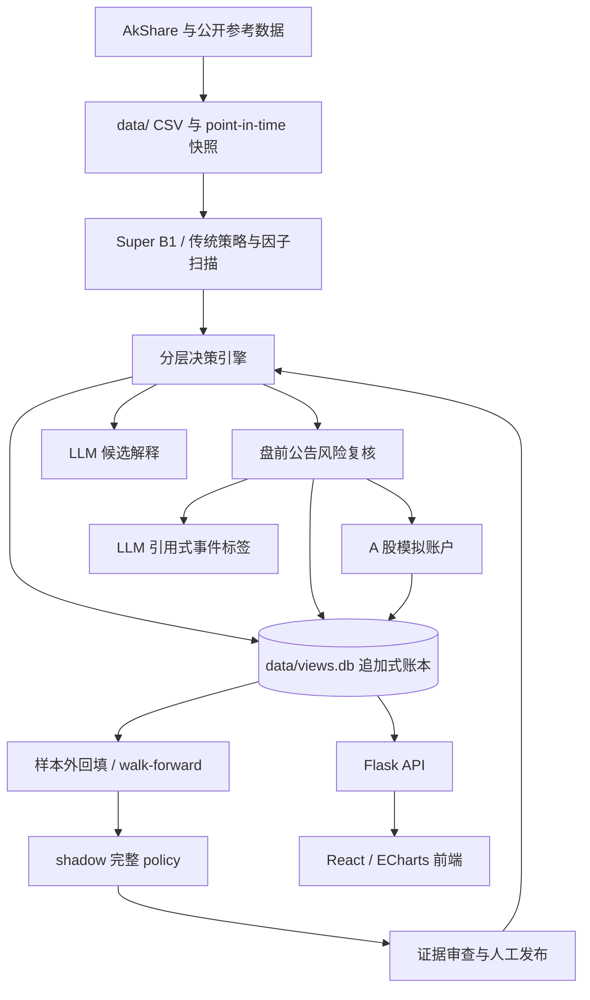

# 系统架构

更新时间：2026-08-14。发布状态必须以线上健康检查与部署 SHA 为准。

## 数据流

## 后端模块

- `main.py`：CLI；初始化、更新、运行、战绩、回测和 Web。
- `web_server.py`：Flask app、传统视图 API、股票/K 线 API、调度器和静态前端。
- `strategy/`：BowlRebound、Super B1、传统 B1 图形匹配与因子库。
- `utils/super_b1_scan.py`：当前纯规则 baseline。
- `utils/hierarchical_decision.py`：收盘与盘前两阶段决策。
- `utils/decision_ledger.py`：append-only 决策、AI、事件证据、演进尝试、完整 policy 与发布事件。
- `utils/paper_trading.py`：模拟账户、委托、成交尝试、持仓批次、现金、净值与对账。
- `utils/ai_decision.py`：根据量化决策记录 `not_called`、`abstained`、`explained`、`shadow_ranked` 或失败状态。
- `utils/decision_versions.py`：策略、特征、模型和数据指纹。
- `utils/reference_snapshots.py`：历史时点参考数据快照。
- `tools/hierarchical_walk_forward.py`：purged walk-forward 训练与验证。
- `utils/event_risk.py`：公告获取、硬规则与可选 LLM 标签。
- `utils/daily_pick.py`：旧荐票档案兼容与当前解释器；生产 LLM 无选票权。
- `views/factor_api.py`：策略清单（含常用组合 `PRESETS`）、单策略扫描与多因子组合 `/api/factor-compose`（`keys` + `join=and|or`）；板块热度只作为命中项的附加展示字段。
- `strategy/factors/shenji_family.py`：神机·生命线因子，收盘带 0.5% 容差上穿 MA13 且涨幅 > 2%，反推口径见 `docs/model-governance.md`。
- `views/quant_pick_api.py`：沿用旧响应形状；返回云阶命中和板块综合热度展示顺序，并可附带版本化决策，但当前不保持旧 `today_buy` 的批准语义。
- `utils/sector_rotation.py`：板块综合热度、相对强度、广度与成交活跃度缓存；它不是 active policy 的替代品。

## API

纯查询能力主要包括：

- `/api/stats`、`/api/stocks`、`/api/stock/<code>`、K 线与行业；
- `/api/factors`；
- `/api/decision/<run_id>`、`/api/decision/system-status`；
- `GET /api/performance/summary`、`GET /api/performance/records`、`GET /api/decision/evolution`。

以下 GET 是 read-through 接口，不能按“无副作用查询”运维：

- `GET /api/decision/latest`：行情新鲜但缺少当前版本决策时，会运行收盘决策并追加账本；
- `GET /api/quant-pick`：会扫描云阶候选；启用分层决策时也可能生成并追加当前收盘决策；返回的板块综合热度顺序只是沿用旧形状的展示；
- `GET /api/super-b1`：缓存缺失或过期时会全量扫描并写入 JSON 缓存；
- `GET /api/factor-scan?force=1` 与板块接口：可强制计算并更新本地缓存；
- `GET /api/factor-compose?keys=a,b&join=and|or`：任一因子当日未缓存时会触发该因子的全市场扫描并写缓存；任一因子不可用则整体阻断，不返回部分交集。连命中天数只用已缓存的历史交易日推算。

会修改运行状态或数据的端点包括：

- `POST /api/data/update`；
- `POST /api/data/bootstrap`；
- `POST /api/decision/close`、`POST /api/decision/preopen`；
- `POST /api/decision/evolution`；
- scheduler start/stop、视图写入和战绩 refresh。

当前 Flask app 没有登录、权限或 CSRF 层。这些接口只能通过网络边界保护。

## 数据与一致性

- 行情、股票映射、参考快照和 SQLite 都在 ignored 的 `data/`。
- 主 SQLite 是 `data/views.db`；`views/views.db` 不被代码使用。
- 决策 run 保存 as-of、阶段、动作、四类版本、source refs、层级输出和 reason codes。
- 同一天的演进、AI 和事件证据允许多次尝试，每次使用独立 ID 追加保存，不覆盖失败历史。
- 模拟盘的委托、成交尝试、持仓批次、现金事件、净值与对账均追加保存；状态由事件重建。
- 当前 `FEATURE_VERSION=b1-hierarchy-v3`，ledger 为 `decision-ledger-v2`。
- 生产只读取一个完整 active policy；该 policy 必须同时包含 market、sector、risk、quality 四个组件以及合格的 point-in-time / purged walk-forward 证据。
- `/api/quant-pick` 的 `today_buy` 是旧字段名，不等于账本中的 `buy`；权威动作来自版本化决策 run。
- 当前 `/api/quant-pick` 把所有云阶命中放进 `today_buy`，陈旧行情下也可能返回 `available=true`；旧客户端仍会把该字段显示为“今日推荐”。在字段语义和 stale fail-closed 恢复前，该兼容组合不可发布。
- 数据新鲜度用多只锚定股票的完成交易日判断；不新鲜时，版本化决策拒绝生成新的可执行动作。
- `utils/akshare_fetcher.py` 当前在两个真实行情来源都失败后会生成随机 OHLCV，初始化/回补路径还可能把它写入正式股票 CSV。文件没有可靠的来源标记，因此 freshness 不能证明数据真实；该实现修复并重建受影响数据前，相关研究与决策不可发布。

## 前端

前端使用项目内基于 History API 的轻量路由、SWR 与 Zustand。默认入口是板块页：

- `/sectors` 单页工作台；旧 `/sectors/:name` 只重定向到带查询参数的工作台；
- `/stocks`；
- `/review`；
- `/stock/:code`。

K 线由 ECharts 渲染，支持日/周语义、历史信号和 Super B1/周线证据。旧 today/performance/history 路由只做兼容重定向。

`frontend/src/pages/today.tsx` 与 `TodayRecommendCard` 目前没有可达路由；`/today` 只重定向到 `/stocks`。它们是待清理的旧实现，不是现行产品能力。

## 调度与部署

- Flask 非 debug 启动时创建 APScheduler，并启动行情 universe 回补。
- `python3 main.py web` 会走上述非 debug 路径，当前没有禁用 universe bootstrap 的 CLI 开关；它不是安全的只读启动入口。
- APScheduler 使用周一至周五 cron，不直接识别交易所休市日；16:00 任务仍须通过数据 freshness / 交易日门禁，再依次更新行情与快照、执行前一日模拟委托并对账、刷新规则/战绩/板块/因子、登记 shadow 挑战策略、生成收盘决策并记录 AI 状态。
- 08:45 盘前任务同样按工作日触发，复核隔夜事件，并把最终 `buy` 动作登记为下一开盘模拟委托。
- 每日演进任务无发布权限；完整 policy 的 active 切换只能经过独立发布门禁。
- Docker 镜像先构建前端，再复制到 Python 镜像；Compose 挂载 `quant-data` volume。镜像安装了 gunicorn，但当前 CMD 实际运行 `python web_server.py` 的 Flask 内置服务器。
- Dockerfile 当前 `COPY . .` 且仓库没有 `.dockerignore`；未改为严格构建白名单前，工作区内容可能进入构建上下文和镜像。
- GitHub Actions 在 `main` push 后自动部署，也支持手工触发；两者都部署 `origin/main`，健康检查后主动更新行情并生成收盘决策。

`main.py` 仍保留 `run_schedule()`，但 argparse 没有 `schedule` 命令；它是不可达旧路径，不是受支持入口。

发布与回滚细节见 [运维手册](operator-runbook.md)。
