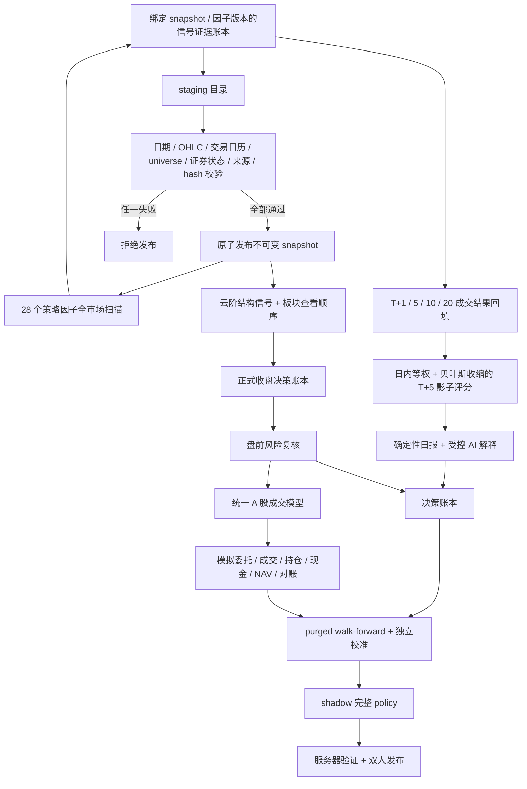

# 系统架构

更新时间：2026-08-11。本文说明仓库当前实现；线上版本以发布工作流和 `/api/version` 为准。

## 总体数据流

## 进程边界

### Web/API

`web_server.py` 只负责：

- 读取当前不可变快照、已落账决策和 worker 预计算结果；
- 提供常数级 `/healthz` 和版本端点；
- 对改变状态的管理请求做 Bearer Token 角色校验、短时 HMAC 验签、nonce 防重放、持久限流和审计；受保护 GET 只认证、不写运行库；
- 把长任务写入有容量上限的 SQLite 持久队列，并允许管理员安全取消尚未开始的任务。

Web 不运行 APScheduler，不抓行情，不扫描全市场，不在 GET 中调用 LLM 或写缓存。旧 views、旧 AI 自主荐股和旧 Super B1 tracker 端点固定返回 `410 Gone`。

### Worker

`worker.py` 是唯一行情、决策、模型和模拟盘业务 writer 进程，负责：

- 按租约从持久任务队列领取、心跳和完成任务；
- 通过持久 scheduler lease 保证只有一个调度 leader；
- 每 30 秒对账应有的日级任务，leader 接管后会补齐错过的收盘任务，但不会在 08:45–09:25 之外补跑盘前复核；
- 16:00 执行收盘 DAG：行情快照 → freshness → 历史决策和模拟盘回填 → 板块/温度计/Super B1 → 28 因子扫描并固化信号 → 正式决策 → 因子 T+1/5/10/20 结果回填 → T+5 影子评分 → 确定性日报和受控 AI 解释 → 影子模型进化；
- 08:45 执行盘前复核，仅处理与当前交易日和 snapshot 一致的收盘决策。

任务使用稳定幂等键；queued/running 总量默认上限为 1000，重复幂等提交不占新名额，超过上限会拒绝并生成 critical 告警。每次 attempt 单独落账，可重试失败指数退避，租约过期会先留下失败证据和告警再接管。固定调度键的最新任务若最终 failed/cancelled，当前 scheduler leader 只能在 5 分钟恢复冷却后追加新的 execution generation；旧任务、旧 attempt 和令牌不改写，恢复动作同时写入不可变审计与告警。已成功、排队或正在运行的代次不会重开。queued 任务可原子取消；running 任务不能伪装成已停止。计算期间不长时间持有数据库事务。

### 一次性 migration

`tools/migrate_databases.py` / `python main.py migrate` 是唯一允许创建或修改生产表结构的入口。发布前，`tools/migration_dry_run.py` 会通过 SQLite online backup 把两个活动账本复制到一次性目录，并只在副本上执行完整 migration 和 predeploy。Web、worker 和普通业务写连接会用只读 URI 校验：

- 数据库文件已存在；
- 所有必需表和关键列存在；
- schema 版本不低于当前程序要求；
- `quick_check` 和外键检查通过；
- 默认模拟账户和初始现金事件完整。

校验失败时进程拒绝启动，不会边接流量边迁移。

## 存储

### 市场快照

`<data-dir>/market_snapshots/<snapshot_id>/` 是不可变市场快照。manifest 记录 trade date、universe、证券状态、每个文件的哈希、来源、参考数据 provenance 和 schema。发布和读取都校验“manifest 期望文件集 = payload 实际文件集”；多出或缺少任何文件均拒绝。

日更必须从已验证的可信快照复制 staging；全量重建从空 staging 开始，不继承旧行情。`<data-dir>/.ingestion_state/` 仅保存 bootstrap/重试等操作状态，它不在快照 payload 中。当前指针只在整批验证成功后原子切换。如当前快照已是最近完成交易日，收盘 DAG 复用它并继续下游，不做全市场重复请求。

### SQLite

- 本地默认的 `data/views.db` / `data/operations.db`：分别保存决策、模型、模拟盘账本，以及任务、job 幂等记录、调度租约、限流、nonce、安全审计和不可变运行告警。
- 本地可用 `--data-dir` / `--state-dir`（或 `QUANT_DATA_DIR` / `QUANT_STATE_DIR`）把市场快照与运行账本明确分盘；Web、worker、派生缓存和回放共用同一解析入口。
- 生产 Compose 把两个 SQLite 放在独立 `/app/state` volume；Web 只读挂载 `/app/data` 市场快照，仅对 state volume 拥有账本/任务写权。
- 决策侧 runtime schema 当前为 v6，操作侧为 v7。决策结果按候选股保留只追加的观测序列；因子信号、逐窗口结果和每日全策略复盘也分别落入不可变账本，并绑定 `snapshot_id`、因子/策略版本、缓存产物 hash 与成交规则版本。内容 SHA-256 同时用于幂等和读取校验。API 和统计只使用来源可验证的物化结果。决策、候选、结果、演进、因子证据、策略日报、事件证据、AI 解释、模型/policy 注册与发布证据、量化点评和模拟盘各账本均由数据库 trigger 阻止改写/删除；安全审计和运行告警事件同样不可变。操作侧每次任务 attempt 还有独立执行令牌；租约失效后旧进程不能继续提交复盘、模型或业务任务结果。
- 云阶证据不由 Web 临时生成。Worker 只使用已绑定市场快照中的云阶结构和板块产物，按固定 70/30 公式生成优先级；它不抓取个股消息，AI 也不接收消息或改变候选与排序。历史事件账本继续只追加保留，但不进入当前云阶决策路径。

当前为单机、单业务 writer、低并发设计。operations DB 例外地接收一个 Web 进程的认证/入队短事务和 worker 的任务短事务，依靠 WAL、`BEGIN IMMEDIATE`、busy timeout 和重试串行化；长计算不持有事务。若需要多个 Web/worker 进程、多机副本或大量并发任务，必须迁移 PostgreSQL 和专用任务队列，不应继续用 SQLite 锁扩展。

## 策略与版本

- 生产 baseline：Super B1。旧 BowlRebound 不再由生产包导出或注册；其 CLI 只在 `research/legacy/` 中通过双重显式开关运行，并强制使用仓库外目录。
- 当前特征 schema：`b1-hierarchy-v6`。
- 当前决策账本：`decision-ledger-v4`。
- 当前成交规则：`a-share-eod-open-open-v5`（按已绑定快照的交易所会话轴推进，停牌缺 bar 仍消耗会话）。
- 当前参考快照：`point-in-time-reference-snapshots-v4`。
- 当前训练时点契约：`point-in-time-feature-snapshots-v1` + `super-b1-pit-feature-ledger-v2`；每个不可变快照只固化它所属交易日的特征，每行特征快照 ID 必须与当日参考快照 ID 完全一致。分片身份同时绑定特征源码、股票宇宙配置和依赖锁；实现变化不会复用旧特征。每日分片以单个原子 generation 目录发布 CSV 与 seal manifest，读取和建集都复验行数、股票集合与规范内容哈希。历史月份足够但信号稀疏、不能形成真实 walk-forward 折或独立校准窗时，仍只显示预热并保留冠军，不声称已训练挑战模型。
- 当前全策略影子模型：`strategy-shadow-score-v2`。T+5 是唯一主评分窗口；同一信号日股票先等权，再跨信号日等权。只在最近 60 个原始信号日内计算，至少 20 个成熟信号日且 60 条成熟记录，且无终局执行失败或逾期未解证据，才产生影子排名和权重。移出/退市代码从其最后可验证历史快照继续水合，不会因为不在今日股票池就从分母消失。AI 只能解释结果。
- 完整 policy 有 market、sector、entry_risk、exit_risk 和 quality 五个组件，不允许拼接不同版本。

`strategy_version()` 对策略、因子、执行、配置、walk-forward 和锁文件的实际内容取指纹，并绑定完整 Git SHA。缓存键同时包含 snapshot ID、策略版本、Git SHA、universe/reference hash 和缓存 schema，因此同日数据修正不会命中旧结果。Super B1、板块、因子和市场温度计还有各自的规范内容 SHA-256；读取时同时校验身份与内容，实际摘要会进入决策账本。

## API 边界

主要只读端点：`/healthz`、`/readyz`、`/api/version`、`/api/stats`、`/api/stocks`、`/api/stock/<code>`、`/api/decision/latest`、`/api/review/daily/latest`、`/api/performance/*`、`/api/super-b1`、`/api/factors` 和板块端点。

会改变状态的端点要求 publisher/admin，必须同时提供：

- `Authorization: Bearer <token>`；
- 8–128 字符的 `Idempotency-Key`；
- 3–500 字符的 `X-Change-Reason`；
- `X-Request-Timestamp` / `X-Request-Nonce` / `X-Request-Signature`。

签名有效期默认 300 秒，同一 principal 的 nonce 只能成功使用一次。签名原文同时绑定 method、path/query、body hash、幂等键和变更原因。

任务状态、调度状态和告警事件需要 viewer 角色。`POST /api/tasks/<task_id>/cancel` 需要 admin、签名和变更原因，只能取消 queued 任务。

## 发布边界

CI 分为后端、前端和安全门禁。发布必须人工选择已测试的完整 SHA，构建不可变镜像，生成 SBOM/来源证明，签名并扫描。GitHub runner 按 digest 拉取该镜像、验证构建 SHA，再通过 SSH 传入目标主机；目标主机必须得到相同的内容寻址镜像 ID，Compose 也禁止自行拉取。Web 只绑定 localhost，容器非 root、只读根文件系统、丢弃 capabilities。目标主机先停止旧 web/worker，再备份静止账本并在临时数据库副本上演练迁移；正式迁移和只读预检通过后，使用 data/state 双只读的隔离 canary 核对候选镜像 ID、SHA、snapshot 和只读查询，才切换正式 web/worker。切换前任一步失败都会恢复旧发布文件并尝试重启旧服务。
