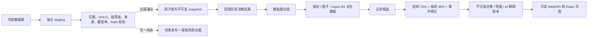

# 数据管线说明

更新日期：2026-08-09。本文描述仓库当前实现；线上是否已经切换以发布工作流和 `/api/version` 为准。

## 一句话结论

系统会把每日行情保存在本地不可变快照中，K 线和决策页只读取已验证快照，不会在浏览器打开页面时临时拉取外部行情。

## 1. 数据从哪里来

| 数据 | 主来源 | 备用/校验来源 | 当前用途 |
| --- | --- | --- | --- |
| 日线 K 线 | 腾讯 `qfqday` | 东方财富 `stock_zh_a_hist`；新浪 `stock_zh_a_daily` 做独立发布校验 | 前复权 OHLCV，建立 6 年基线和每日增量 |
| 交易日历 | 新浪交易日历（由 AkShare 适配） | 已发布快照内的上一版日历 | 判断“最近已完成交易日” |
| 股票主表 | AkShare `stock_info_a_code_name` | 腾讯 `qt.gtimg.cn` 报价确认；上一版已验证名单 | 发现全部 A 股，再按项目范围筛选主板 |
| 停复牌 | AkShare `stock_tfp_em` | 无合法证据时不猜测 | 区分行情缺失与当日合法无交易 |
| 退市名单 | 上交所/深交所退市目录（由 AkShare 适配） | 上一版已验证目录 | 从可用股票池中排除退市标的 |
| 行业分类 | 东方财富行业板块 | 新浪板块成分；申万历史行业分类 | 板块排名、行业广度和个股归属 |
| 总市值 | 东方财富全市场快照 | 腾讯报价接口 | 市值分组和参考元数据 |
| 候选股近期消息 | 东方财富个股资讯（AkShare `stock_news_em`） | 已落账公告事件 | 云阶候选近 30 日消息、利好/利空与风险证据 |

主源失败时，备源只有在数量、日期、schema 和覆盖率达标后才会接管。所有来源都失败时，任务会失败并保留 staging，不会生成随机或模拟行情。

## 2. 数据什么时候来

- Worker 每 30 秒对账应有任务，不依赖单一 cron 时刻。
- 交易日 16:00 后创建当日收盘任务；如当时停机，恢复后按原交易日补跑。
- 完整行情截止点是 15:05。15:05 前运行时，只能使用上一个已完成交易日。
- 周末和节假日不会把自然日当作交易日；以交易日历中最近已完成日期为准。
- 盘前复核仅在交易日 08:45–09:25 运行，它不重拉历史 K 线。
- 如当前已验证快照就是最近已完成交易日，收盘闭环直接复用它，不重复请求 3,000 多只股票。
- 云阶消息只在 worker 生成收盘决策时按已命中候选逐只拉取，并锁定 `cutoff_at`；浏览器 GET 不会触发外部抓取。失败时保留云阶候选，只把情报覆盖标记为不完整。

## 3. 整个逻辑是什么



发布成功的快照由内容 hash 生成 `snapshot_id`。`CURRENT_SNAPSHOT` 只在整批验证通过后原子切换，因此页面不会读到“一半新、一半旧”的数据。

收盘闭环固定为五步：采集/复用正式行情、确认快照、回填历史结果、模拟盘估值、生成派生指标和收盘决策。云阶命中后，系统再按“结构 70% + 板块 30% + 有上限的事件修正”形成可追溯优先级；AI 只解释这份已落账证据，不增删候选，也不制造没有来源的利好利空。上游任一步失败，下游不继续。

## 4. K 线图如何获取信息

1. 全量基线通过腾讯 `qfqday` 按页拉取，每页最多 640 条，用 `end_date` 向历史翻页，直到覆盖请求的 6 年窗口或达到上市日。
2. 数据以前复权 `qfq` 存为每股 CSV，并记录来源、请求起止日期、实际起止日期、行数和抓取时间。
3. 正式发布要求腾讯加一个独立历史来源；东方财富不可用时由新浪校验锚定股。
4. `GET /api/stock/<code>/kline` 只读取 `CURRENT_SNAPSHOT` 中的 CSV，返回 `snapshot_id`、`source_id`、`history_source_id`、`stored_from` 和 `stored_rows`。
5. 日 K 的 KDJ、趋势线等在本地从这份 CSV 计算；周 K 也是从同一份日线本地重采样，不再请求外部网站。

## 5. 数据存在哪里

本地推荐显式使用两个目录：

```text
.runtime/
├── market-data/
│   ├── CURRENT_SNAPSHOT
│   ├── market_snapshots/<snapshot_id>/
│   │   ├── manifest.json
│   │   └── payload/<code-prefix>/<stock-code>.csv
│   ├── .snapshot_staging/
│   └── .ingestion_state/
└── state/
    ├── views.db
    └── operations.db
```

- `market-data` 保存行情、股票池、行业、市值、证券状态和快照 manifest。
- `views.db` 保存决策、候选、模型、模拟盘和结果账本。
- 云阶候选的消息证据、情报截止点、优先级和 AI 解释一并写入 `views.db` 的不可变 AI 决策运行记录；原始个股资讯响应只作为可重建的 worker 缓存，不作为页面事实源。
- `operations.db` 保存任务、每次尝试、调度租约、告警和审计状态。
- Web、worker、决策和回放必须使用同一组 `--data-dir` / `--state-dir`，否则会看到不同世界。

## 6. 存储多少天

正式策略已经确定为**长期保留**，机器可读值为 `retention_policy=indefinite`、`retention_days=null`。系统不会自动删除正式快照或失败 staging。这不是“只保留最近一天”：每次成功发布都会新增一个不可变快照，旧快照不会被新快照覆盖。

与快照绑定的决策、云阶候选、情报证据和 AI 运行记录同样按只追加账本保存；历史页面回读的是当时的截止时间与证据，不会用今天的新消息改写过去的推荐理由。

状态页会把该策略显示为已配置，并实时显示正式快照数和 staging 数，不再将“未设置自动清理天数”误报为异常。以后若要改成按天清理，必须先明确回溯期、异地备份与恢复流程，再通过一次明确的变更发布；当前版本没有任何自动清理任务。

## 7. 如何查当前真实状态

- 首屏 `/stocks`：先给出当日云阶数量、市场温度、第一/第二推荐、行业排名和情报覆盖。
- 详情页 `/data-pipeline`：显示最近任务的五个阶段、来源、更新时间、路径和保留状态。
- API `/api/data-pipeline/status`：返回同一份机器可读状态。
- API `/api/sectors` 和 `/api/stock/<code>/kline`：都返回 `snapshot_id`，用它确认页面是否读到同一份行情。

## 8. 2026-08-08 本地验收证据

- 已发布快照：`2e19113685ba0e7a4be5d4d054a80ac1ba013bc587c289dc2bfe1ec656488e00`。
- 快照交易日：2026-08-07；主板股 3,179 只；有效覆盖率 100%；四只锚定股全部到 2026-08-07。
- 行情发布来源：腾讯 + 新浪；行业和市值覆盖率均为 100%。
- `000001` 与 `600519` 都保存 1,454 条日线，时间范围 2020-08-10 至 2026-08-07。
- 收盘闭环五个阶段全部完成，生成决策 `run_id=21878f124152f171309fce1d`，与上述快照同日。
- 这些运行数据位于本地 `.runtime/`，不进入 Git，也不能代替目标生产环境的部署验收。
